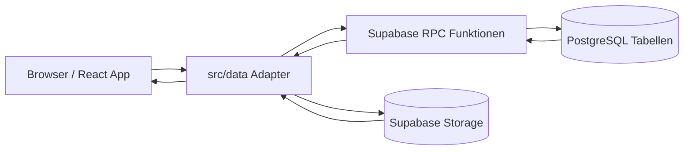

# Architektur

Diese Dokumentation beschreibt den aktuellen Stand der Hurricane Awards App. Sie soll neuen Mitwirkenden helfen, die vorhandene Struktur, Datenfluesse und wichtigsten Architekturentscheidungen schnell zu verstehen.

## Gesamtarchitektur

Die Anwendung ist eine React Single Page App, die als statisches Frontend gebaut und gehostet wird. Das Frontend verwendet den Supabase anon Key und spricht nicht direkt mit geschuetzten Tabellen. Sensible Zugriffe laufen ueber PostgreSQL RPC-Funktionen in Supabase.

- Frontend: React, TypeScript und Vite. `src/App.tsx` steuert die Hauptansicht, Login, Abstimmung, Ergebnisse und Adminbereiche.
- Supabase: Stellt den PostgREST RPC-Zugriff mit anon Key bereit. Direkte Tabellenrechte fuer Browserrollen sind fuer geschuetzte Tabellen entzogen.
- Supabase Storage: Speichert Festivaldokumente fuer den Infos-Bereich. Metadaten und Berechtigungen laufen ueber RPCs; Dateien werden aus dem Frontend in einen dedizierten Bucket geladen.
- Datenbank: PostgreSQL Tabellen, RLS Policies und `security definer` RPC-Funktionen in `supabase/migrations`.
- Hosting: Das Vite-Build-Ergebnis in `dist` kann als statische Website gehostet werden. Supabase hostet Datenbank und RPC-Schicht getrennt vom Frontend.
- Zusammenspiel: UI-Aktionen rufen Funktionen aus `src/data/*` auf. Diese Adapter rufen Supabase RPCs auf. Die RPCs pruefen Berechtigungen, lesen oder schreiben Tabellen und geben nur die fuer die UI benoetigten Daten zurueck.

## Projektstruktur

- `src`: React App, Datenadapter, Konfiguration, Styles, Internationalisierung und Tests.
- `src/App.tsx`: Zentrale App-Komponente mit Festivalzugang, Teilnehmerlogin, Datenladen, Abstimmung, Ergebnisanzeige und Admin-Interaktionen.
- `src/App.css` und `src/index.css`: Globale UI-Styles.
- `src/components`: Wiederverwendbare Admin-Komponenten, aktuell fuer Teilnehmer, Kategorien und Festivalaktionen.
- `src/data`: Supabase-Datenadapter. Diese Dateien kapseln RPC-Aufrufe und mappen Datenbank-Rows auf Frontend-Typen.
- `src/data/accessContext.ts`: Einheitliche Struktur fuer Teilnehmer-/Admin-Kontext bei RPC-Aufrufen.
- `src/config/festivals.ts`: Lokale Festivalkonfiguration, unter anderem Storage-Key-Namensraeume.
- `src/hooks/useFestivalAccess.ts`: Lokale Freischaltung des gemeinsamen Festivalzugangs.
- `src/i18n`: Uebersetzungen und i18next-Konfiguration. Sichtbare UI-Texte liegen in `de.json` und `nl.json`.
- `src/test`: Vitest- und React-Testing-Library-Tests fuer UI, Datenadapter, i18n und Migrationen.
- `supabase/migrations`: Datenbankmigrationen fuer RLS, RPCs, Integritaet, Adminfunktionen, Festivalname, Archivierung und Login-Schutz.
- `docs`: Ergaenzende Dokumentation, aktuell Sicherheits- und Architekturdokumentation.
- `public`: Statische Assets wie Icons und PWA-Dateien.
- `vite.config.ts`: Vite-, Test- und PWA-Konfiguration.
- `package.json`: Scripts, Dependencies und Dev-Dependencies.

## Datenfluss

### Login

Es gibt zwei Zugangsebenen:

1. Der gemeinsame Festivalcode wird ueber `ha_verify_festival_access_code` geprueft. Die App speichert danach eine technische Access-Version in `localStorage`, nicht den Festivalcode selbst.
2. Der persoenliche Teilnehmercode wird serverseitig ueber `ha_login_participant` geprueft und nur fuer die aktuelle Browser-Session in `sessionStorage` gehalten.

Der Teilnehmerlogin laeuft ueber `loginParticipant` in `src/data/participants.ts`. Bei Erfolg erhaelt das Frontend nur die fuer die Session benoetigten Teilnehmerdaten: `id`, `name`, `displayName`, `avatarId`, `isAdmin`, `isActive` sowie den eingegebenen Code fuer weitere RPC-Kontexte.

### Serverseitige Loginpruefung

`ha_login_participant` prueft den normalisierten Teilnehmercode in PostgreSQL. Inaktive Teilnehmer werden wie ungueltige Codes behandelt. Ungueltige Versuche werden in `participant_login_attempts` gezaehlt. Die Tabelle speichert einen technischen Hash fuer den Rate-Limit-Schluessel, aber keine Teilnehmercodes im Klartext.

Nach zu vielen Fehlversuchen gibt die RPC-Funktion den Status `blocked` und `locked_until` zurueck. Die UI zeigt eine uebersetzte, sichere Sperrmeldung und einen Countdown. Bei erfolgreichem Login wird der relevante Zaehler geloescht.

`ha_verify_festival_access_code` nutzt analog `festival_access_attempts`. Ungueltige Festivalcodes werden serverseitig gezaehlt, nach mehreren Fehlversuchen temporaer blockiert und bei erfolgreicher Eingabe zurueckgesetzt. Auch diese Tabelle speichert nur technische Rate-Limit-Schluessel und keine Klartextcodes.

### Laden der Kategorien

Nach erfolgreichem Login laedt die App Kategorien ueber `ha_list_categories`. Der Teilnehmercode wird als Zugriffskontext uebergeben. Die Datenbank prueft serverseitig, ob der Code zu einem aktiven Teilnehmer gehoert.

Adminansichten laden Kategorien ueber `ha_admin_list_categories`. Diese RPC ist zusaetzlich durch `ha_has_admin_access` abgesichert.

### Abstimmen

Stimmen werden ueber `ha_save_vote` gespeichert. Die RPC prueft:

- Der Teilnehmercode passt zum abstimmenden Teilnehmer.
- Selbstvotes sind nicht erlaubt.
- Die Kategorie ist offen.
- Das Ziel existiert.
- Pro Waehler und Kategorie gibt es nur eine Stimme.

Persoenliche bereits abgegebene Stimmen werden ueber `ha_list_participant_votes` geladen. Ergebnisstimmen fuer die Anzeige laufen ueber `ha_list_result_votes`.

### Ergebnisanzeige

Das Frontend berechnet die sichtbaren Kategorieergebnisse aus Teilnehmerliste, Kategorien und geladenen Stimmen. Die Daten werden ueber RPCs bereitgestellt; direkte Tabellenzugriffe aus dem Browser sind nicht vorgesehen.

Das Gesamtclassement wird ueber `ha_list_all_time_standings` geladen. Die Funktion liest aus `all_time_standings`, falls diese Relation vorhanden ist.

### Adminfunktionen

Adminfunktionen sind nur UI-seitig sichtbar, wenn der Login-RPC `is_admin = true` zurueckgibt. Verbindlich ist aber die Datenbank: Admin-RPCs pruefen serverseitig `ha_has_admin_access`.

Langfristig soll dieses Modell durch echte Admin-Sessions ueber Supabase Auth oder eine Edge-Function-Schicht ersetzt werden. In der aktuellen Architektur bleibt die Code-basierte Pruefung bestehen; Tests sichern ab, dass Admin-RPCs ihre interne Adminpruefung behalten.

Admin-RPCs umfassen unter anderem:

- Teilnehmer: `ha_admin_list_participants`, `ha_suggest_participant_access_code`, `ha_create_participant`, `ha_update_participant`, `ha_deactivate_participant`, `ha_reactivate_participant`
- Kategorien: `ha_admin_list_categories`, `ha_create_category`, `ha_update_category`, `ha_update_category_status`, `ha_delete_category`, `ha_delete_category_votes`
- Festival: `ha_update_festival_name`, `ha_get_festival_access_code`, `ha_update_festival_access_code`, `ha_archive_festival`
- Infos: `ha_admin_list_festival_documents`, `ha_upsert_festival_document`, `ha_delete_festival_document`, `ha_admin_get_music_playlist`, `ha_update_music_playlist`, `ha_delete_music_playlist`
- Timetable: `ha_admin_list_festival_days`, `ha_create_festival_day`, `ha_update_festival_day`, `ha_delete_festival_day`, `ha_admin_list_timetable_stages`, `ha_create_timetable_stage`, `ha_update_timetable_stage`, `ha_delete_timetable_stage`
- Bingo: `ha_admin_get_bingo_round`, `ha_start_bingo_round`, `ha_close_bingo_round`

### Festivalinfos und Dokumente

Der Infos-Bereich zeigt zentrale Festivaldokumente innerhalb der App an. Die Dokumentmetadaten liegen in `festival_documents` mit `document_type`, `title`, `file_path`, `mime_type` und `updated_at`. Aktuell sind die Typen `timetable` und `site_map` vorgesehen; die Struktur ist so gehalten, dass weitere Typen spaeter ergaenzt werden koennen.

Die Dateien liegen im Supabase-Storage-Bucket `festival-documents`. Teilnehmer laden sichtbare Dokumentmetadaten ueber `ha_list_festival_documents`; der Frontend-Adapter `src/data/festivalDocuments.ts` erzeugt daraus signierte Anzeige-URLs. Administratoren verwalten die Metadaten ueber Admin-RPCs und laden PDF- oder Bilddateien in Storage hoch. Vor einem Upload erzeugt `ha_create_festival_document_upload` einen kurzlebig erlaubten Storage-Pfad; die Storage-Policy akzeptiert Uploads nur fuer solche freigegebenen Pfade. Entfernte Dokumente werden aus der App entfernt, indem der Metadatensatz geloescht wird.

Der Campstandort ist kein eigenes Karten- oder GPS-Modell. Er wird als einzelner Link im `app_settings` Key `camp_location_link` gespeichert und ueber `ha_get_camp_location_link` gelesen. Admins koennen den Link ueber `ha_update_camp_location_link` setzen oder ueber `ha_delete_camp_location_link` entfernen. Die Datenbank validiert, dass nur unterstuetzte HTTPS-Links zu Google Maps oder WhatsApp gespeichert werden.

Die Festival Playlist wird als Spotify Playlist ID im `app_settings` Key `music_spotify_playlist_id` gespeichert. Teilnehmer laden die normalisierten Playerdaten ueber `ha_get_music_playlist`; Admins setzen oder entfernen sie ueber `ha_update_music_playlist` und `ha_delete_music_playlist`. Die App verwendet ausschliesslich den offiziellen Spotify Embed Player (`https://open.spotify.com/embed/playlist/...`) und bietet zusaetzlich einen Link zur Playlist auf Spotify an. Es werden keine Spotify-Nutzerdaten, Tokens oder personenbezogenen Spotify-Daten gespeichert.

### Bingo

Der Bingo-Bereich ist nur sichtbar, wenn eine aktive Bingorunde existiert. Admins starten oder beenden diese Runde im Adminbereich unter Bingo. Die Ziehung bleibt analog; die App speichert nur individuelle Karten und Markierungen.

Teilnehmer laden ihre Karte ueber `ha_get_or_create_bingo_card`. Die RPC erzeugt serverseitig genau eine Karte pro Teilnehmer und aktiver Runde, falls noch keine Karte existiert. Die Karte enthaelt 25 eindeutige Zahlen aus dem Bereich 1 bis 75. Markierungen werden ueber `ha_set_bingo_mark` gespeichert oder entfernt und beim erneuten Laden wieder angezeigt. Die App prueft kein Bingo automatisch.

### Timetable

Der Timetable-Bereich ist als technische Basis vorbereitet. Die App zeigt einen eigenen Hauptbereich und laedt strukturierte Basisdaten ueber `src/data/timetable.ts` und die RPC `ha_get_timetable`.

Das Datenmodell trennt Festivaltage (`festival_days`), Buehnen (`timetable_stages`), Acts (`timetable_acts`) und Auftritte (`timetable_performances`). Ein Auftritt referenziert genau einen Festivaltag, genau eine Buehne und genau einen Act. Es gibt noch keine editierbare Teilnehmer-Timetable-Ansicht, keine Favoritenlogik und keine komplexe Darstellung nach Buehnen oder Zeiten.

Admins koennen im Adminbereich `Timetable` Festivaltage und Buehnen anlegen, bearbeiten, loeschen und ueber die Sortierung bzw. Hoch-/Runter-Aktionen umordnen. Die Verwaltung bleibt bewusst auf diese beiden Entitaeten beschraenkt; Act- und Auftrittsverwaltung sind noch nicht umgesetzt.

### Festivaleinstellungen

Der Festivalname liegt zentral in `app_settings` unter dem Key `festival_name`. Das Frontend liest ihn ueber `ha_get_festival_name`. Admins aendern ihn ueber `ha_update_festival_name`; die RPC validiert einen nicht-leeren Namen.

Der gemeinsame Festivalcode liegt ebenfalls in `app_settings` unter dem Key `festival_access_code`. Die App prueft eingegebene Codes ueber `ha_verify_festival_access_code`, ohne den Codewert oeffentlich auszulesen. Admins lesen und aendern den Code ueber `ha_get_festival_access_code` und `ha_update_festival_access_code`; die Update-RPC validiert einen nicht-leeren Code. Frische Deployments installieren keinen bekannten Default-Code; der initiale Code wird projektspezifisch im Deployment gesetzt.

Es gibt aktuell keine separate Tabelle `festival_settings`.

### Festivalarchivierung

Admins starten die Archivierung ueber `ha_archive_festival`. Die RPC kopiert den aktuellen Stand in eigene Archivtabellen:

- `festival_archives`
- `festival_archive_participants`
- `festival_archive_categories`
- `festival_archive_votes`

Archivdaten sind von aktiven Tabellen getrennt und haben keine Fremdschluessel auf aktive Teilnehmer, Kategorien oder Stimmen. Dadurch bleiben historische Snapshots stabil, auch wenn aktive Daten spaeter geaendert werden.

Teilnehmercodes werden nicht in `festival_archive_participants` gespeichert. Archivierte Teilnehmer enthalten nur die fuer historische Auswertung benoetigten Anzeige- und Statusdaten.

### JSON-Export

Admins koennen den aktuellen Festivalstand als JSON exportieren. Der Standardexport entfernt Teilnehmercodes aus den Teilnehmerdaten. Eine explizite Exportoption kann Codes einschliessen; die UI zeigt dafuer einen Warnhinweis an, weil solche Dateien vertraulich sind.

Teilnehmer koennen ihren Avatar ueber `ha_update_participant_avatar` selbst aendern. Die RPC prueft, dass der uebergebene Teilnehmercode zum bearbeiteten Teilnehmer passt, und speichert nur die stabile Avatar-ID aus der App-Bibliothek. Die Avatarbilder liegen als versionierte SVG-Dateien in `src/assets/avatars`; `src/config/avatars.ts` ordnet stabile IDs den lokal gebuendelten Bildpfaden zu.

## Datenmodell

Diese Uebersicht nennt die wichtigsten Tabellen und ihre Rolle. Sie ersetzt keine vollstaendige Datenbankreferenz.

- `participants`: Teilnehmerdaten, Anzeigenamen, Avatar-ID, persoenliche Codes, Adminstatus und Aktivstatus.
- `categories`: Abstimmungskategorien mit Titel, Beschreibung, Status und Sortierung.
- `votes`: Aktive Stimmen mit Waehler, nominierter Person, Kategorie und Zeitstempel.
- `archived_votes`: Aeltere Archivstruktur fuer Stimmen, die in der Sicherheitsdokumentation noch beruecksichtigt wird.
- `app_settings`: Zentrale App-Einstellungen, aktuell insbesondere `festival_name` und `festival_access_code`.
- `app_settings` Key `camp_location_link`: Optionaler Link zum Campstandort ohne GPS-, Live- oder Bewegungsdaten.
- `app_settings` Key `music_spotify_playlist_id`: Optionale Spotify Playlist ID fuer den offiziellen Embed Player ohne Spotify-Nutzerdaten oder Tokens.
- `all_time_standings`: Quelle fuer das Gesamtclassement, falls als Tabelle, View oder Materialized View vorhanden.
- `festival_archives`: Metadaten eines archivierten Festival-Snapshots.
- `festival_archive_participants`: Teilnehmerinformationen zum Archivzeitpunkt ohne Teilnehmercodes.
- `festival_archive_categories`: Kategorieinformationen zum Archivzeitpunkt.
- `festival_archive_votes`: Stimmen inklusive Anzeigeinformationen zum Archivzeitpunkt.
- `festival_documents`: Metadaten der Festivaldokumente fuer den Infos-Bereich.
- `festival_document_uploads`: Kurzlebige, serverseitig freigegebene Storage-Uploadpfade fuer Festivaldokumente.
- `festival_days`: Festivaltage fuer den strukturierten Timetable.
- `timetable_stages`: Buehnen fuer den strukturierten Timetable.
- `timetable_acts`: Acts fuer den strukturierten Timetable.
- `timetable_performances`: Auftritte, die je einen Festivaltag, eine Buehne und einen Act verbinden.
- `bingo_rounds`: Bingorunden mit Status. Es darf nur eine aktive Runde geben; beim Start einer neuen Runde werden alte aktive Runden geschlossen. Es gibt keine UI-Historie.
- `bingo_cards`: Serverseitig generierte Bingokarten, eindeutig pro Teilnehmer und aktiver Runde.
- `bingo_marks`: Persistierte Markierungen fuer Zahlen auf einer Bingokarte.
- `participant_login_attempts`: Minimale technische Daten fuer serverseitiges Rate Limiting beim Teilnehmerlogin.
- `festival_access_attempts`: Minimale technische Daten fuer serverseitiges Rate Limiting beim Festivalcode.

## Technologiestack

- React: UI-Komponenten und App-Zustand.
- TypeScript: Typisierung fuer Komponenten, Datenadapter und Tests.
- Vite: Entwicklungsserver, Build-System und Testintegration.
- Supabase: Browserseitiger RPC-Zugriff mit anon Key und gehostete PostgreSQL-Datenbank.
- Supabase Storage: Dateiablage fuer Festivaldokumente wie Timetable und Gelaendeplan.
- PostgreSQL: Tabellen, Constraints, RLS und `security definer` Funktionen.
- RPC-Funktionen: Zentrale Schnittstelle zwischen Frontend und Datenbank fuer geschuetzte Operationen.
- Internationalisierung: i18next und react-i18next mit `de.json` und `nl.json`.
- Testframework: Vitest, React Testing Library, jest-dom, jsdom und Migrationstests.
- PWA: Vite PWA Plugin erzeugt Manifest und Service Worker beim Build.

## Wichtige Architekturentscheidungen

- Sensible Operationen laufen ueber serverseitige RPCs statt direkte Tabellenzugriffe.
- RLS und entzogene Tabellenrechte verhindern direkte Browserzugriffe auf geschuetzte Daten.
- Adminfunktionen sind serverseitig ueber `ha_has_admin_access` abgesichert.
- Langfristige Admin-Authentifizierung soll ueber echte Sessions statt weitergebbare Codes erfolgen.
- Festivalname und Festivalcode sind zentral in `app_settings` konfigurierbar; der initiale Festivalcode wird nicht als allgemein bekannter Default installiert.
- Archivdaten liegen getrennt von aktiven Daten, damit Snapshots stabil bleiben.
- Festivalcode und Teilnehmerlogin sind gegen Code-Erraten serverseitig geschuetzt; Rate-Limit-Daten speichern keine Klartextcodes.
- Das Frontend erhaelt beim Login nur die Teilnehmerdaten, die fuer die Session benoetigt werden, und speichert persoenliche Teilnehmercodes nicht dauerhaft in `localStorage`.
- JSON-Exporte enthalten Teilnehmercodes nur nach expliziter Admin-Auswahl.
- Bingo speichert keine gezogenen Zahlen, prueft kein Bingo automatisch und fuehrt keine Historie vergangener Runden.
- Sichtbare UI-Texte werden ueber Uebersetzungsdateien gepflegt und nicht direkt in Komponenten hardcodiert.
- Datenadapter in `src/data` kapseln Supabase RPC-Aufrufe, damit UI-Komponenten nicht direkt mit RPC-Details arbeiten muessen.
- Festivaldokumente trennen Dateiinhalt und Metadaten: Storage enthaelt die Dateien, PostgreSQL/RPCs steuern die sichtbaren Dokumenteintraege.
- Der strukturierte Timetable startet mit getrennten Kernentitaeten, einem Lese-RPC und einer schmalen Adminverwaltung fuer Festivaltage und Buehnen; Acts, Auftritte, Favoriten und komplexe Darstellungen werden bewusst spaeter ergaenzt.

## Wartung und Erweiterung

- Neue Datenbankaenderungen immer als Migration unter `supabase/migrations` anlegen.
- Bei neuen oder geaenderten RPCs die passenden Datenadapter in `src/data` aktualisieren.
- Neue sichtbare UI-Texte immer in `src/i18n/de.json` und `src/i18n/nl.json` ergaenzen.
- Tests bei fachlichen, sicherheitsrelevanten oder UI-sichtbaren Aenderungen erweitern.
- Migrationstests aktualisieren, wenn Tabellen, Policies, Grants oder RPCs angepasst werden.
- Diese Architekturdokumentation bei Architekturentscheidungen oder groesseren Datenflussaenderungen mitpflegen.
- Bei Erweiterungen wie Mehrfestivalfaehigkeit, Historie, Gesamtclassement oder JSON-Export pruefen, welche bestehenden RPCs, Tabellen, Tests und Dokumente betroffen sind.
