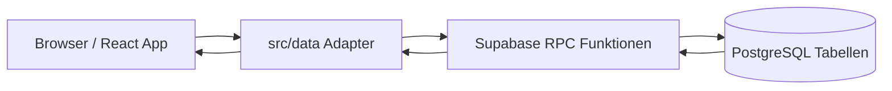

# Architektur

Diese Dokumentation beschreibt den aktuellen Stand der Hurricane Awards App. Sie soll neuen Mitwirkenden helfen, die vorhandene Struktur, Datenfluesse und wichtigsten Architekturentscheidungen schnell zu verstehen.

## Gesamtarchitektur

Die Anwendung ist eine React Single Page App, die als statisches Frontend gebaut und gehostet wird. Das Frontend verwendet den Supabase anon Key und spricht nicht direkt mit geschuetzten Tabellen. Sensible Zugriffe laufen ueber PostgreSQL RPC-Funktionen in Supabase.

- Frontend: React, TypeScript und Vite. `src/App.tsx` steuert die Hauptansicht, Login, Abstimmung, Ergebnisse und Adminbereiche.
- Supabase: Stellt den PostgREST RPC-Zugriff mit anon Key bereit. Direkte Tabellenrechte fuer Browserrollen sind fuer geschuetzte Tabellen entzogen.
- Datenbank: PostgreSQL Tabellen, RLS Policies und `security definer` RPC-Funktionen in `supabase/migrations`.
- Hosting: Das Vite-Build-Ergebnis in `dist` kann als statische Website gehostet werden. Supabase hostet Datenbank und RPC-Schicht getrennt vom Frontend.
- Zusammenspiel: UI-Aktionen rufen Funktionen aus `src/data/*` auf. Diese Adapter rufen Supabase RPCs auf. Die RPCs pruefen Berechtigungen, lesen oder schreiben Tabellen und geben nur die fuer die UI benoetigten Daten zurueck.

## Projektstruktur

- `src`: React App, Datenadapter, Konfiguration, Styles, Internationalisierung und Tests.
- `src/App.tsx`: Zentrale App-Komponente mit Festivalzugang, Teilnehmerlogin, Datenladen, Abstimmung, Ergebnisanzeige und Admin-Interaktionen.
- `src/App.css` und `src/index.css`: Globale UI-Styles.
- `src/components`: Wiederverwendbare Admin-Komponenten, aktuell fuer Teilnehmer, Kategorien und Festivalaktionen.
- `src/data`: Supabase-Datenadapter. Diese Dateien kapseln RPC-Aufrufe und mappen Datenbank-Rows auf Frontend-Typen.
- `src/data/accessContext.ts`: Einheitliche Struktur fuer Teilnehmer-/Admin-Kontext bei RPC-Aufrufen.
- `src/config/festivals.ts`: Lokale Festivalkonfiguration, unter anderem Storage-Key-Namensraeume.
- `src/hooks/useFestivalAccess.ts`: Lokale Freischaltung des gemeinsamen Festivalzugangs.
- `src/i18n`: Uebersetzungen und i18next-Konfiguration. Sichtbare UI-Texte liegen in `de.json` und `nl.json`.
- `src/test`: Vitest- und React-Testing-Library-Tests fuer UI, Datenadapter, i18n und Migrationen.
- `supabase/migrations`: Datenbankmigrationen fuer RLS, RPCs, Integritaet, Adminfunktionen, Festivalname, Archivierung und Login-Schutz.
- `docs`: Ergaenzende Dokumentation, aktuell Sicherheits- und Architekturdokumentation.
- `public`: Statische Assets wie Icons und PWA-Dateien.
- `vite.config.ts`: Vite-, Test- und PWA-Konfiguration.
- `package.json`: Scripts, Dependencies und Dev-Dependencies.

## Datenfluss

### Login

Es gibt zwei Zugangsebenen:

1. Der gemeinsame Festivalcode wird ueber `ha_verify_festival_access_code` geprueft. Die App speichert danach eine technische Access-Version in `localStorage`, nicht den Festivalcode selbst.
2. Der persoenliche Teilnehmercode wird serverseitig ueber `ha_login_participant` geprueft und nur fuer die aktuelle Browser-Session in `sessionStorage` gehalten.

Der Teilnehmerlogin laeuft ueber `loginParticipant` in `src/data/participants.ts`. Bei Erfolg erhaelt das Frontend nur die fuer die Session benoetigten Teilnehmerdaten: `id`, `name`, `displayName`, `isAdmin`, `isActive` sowie den eingegebenen Code fuer weitere RPC-Kontexte.

### Serverseitige Loginpruefung

`ha_login_participant` prueft den normalisierten Teilnehmercode in PostgreSQL. Inaktive Teilnehmer werden wie ungueltige Codes behandelt. Ungueltige Versuche werden in `participant_login_attempts` gezaehlt. Die Tabelle speichert einen technischen Hash fuer den Rate-Limit-Schluessel, aber keine Teilnehmercodes im Klartext.

Nach zu vielen Fehlversuchen gibt die RPC-Funktion den Status `blocked` und `locked_until` zurueck. Die UI zeigt eine uebersetzte, sichere Sperrmeldung und einen Countdown. Bei erfolgreichem Login wird der relevante Zaehler geloescht.

`ha_verify_festival_access_code` nutzt analog `festival_access_attempts`. Ungueltige Festivalcodes werden serverseitig gezaehlt, nach mehreren Fehlversuchen temporaer blockiert und bei erfolgreicher Eingabe zurueckgesetzt. Auch diese Tabelle speichert nur technische Rate-Limit-Schluessel und keine Klartextcodes.

### Laden der Kategorien

Nach erfolgreichem Login laedt die App Kategorien ueber `ha_list_categories`. Der Teilnehmercode wird als Zugriffskontext uebergeben. Die Datenbank prueft serverseitig, ob der Code zu einem aktiven Teilnehmer gehoert.

Adminansichten laden Kategorien ueber `ha_admin_list_categories`. Diese RPC ist zusaetzlich durch `ha_has_admin_access` abgesichert.

### Abstimmen

Stimmen werden ueber `ha_save_vote` gespeichert. Die RPC prueft:

- Der Teilnehmercode passt zum abstimmenden Teilnehmer.
- Selbstvotes sind nicht erlaubt.
- Die Kategorie ist offen.
- Das Ziel existiert.
- Pro Waehler und Kategorie gibt es nur eine Stimme.

Persoenliche bereits abgegebene Stimmen werden ueber `ha_list_participant_votes` geladen. Ergebnisstimmen fuer die Anzeige laufen ueber `ha_list_result_votes`.

### Ergebnisanzeige

Das Frontend berechnet die sichtbaren Kategorieergebnisse aus Teilnehmerliste, Kategorien und geladenen Stimmen. Die Daten werden ueber RPCs bereitgestellt; direkte Tabellenzugriffe aus dem Browser sind nicht vorgesehen.

Das Gesamtclassement wird ueber `ha_list_all_time_standings` geladen. Die Funktion liest aus `all_time_standings`, falls diese Relation vorhanden ist.

### Adminfunktionen

Adminfunktionen sind nur UI-seitig sichtbar, wenn der Login-RPC `is_admin = true` zurueckgibt. Verbindlich ist aber die Datenbank: Admin-RPCs pruefen serverseitig `ha_has_admin_access`.

Admin-RPCs umfassen unter anderem:

- Teilnehmer: `ha_admin_list_participants`, `ha_suggest_participant_access_code`, `ha_create_participant`, `ha_update_participant`, `ha_deactivate_participant`, `ha_reactivate_participant`
- Kategorien: `ha_admin_list_categories`, `ha_create_category`, `ha_update_category`, `ha_update_category_status`, `ha_delete_category`, `ha_delete_category_votes`
- Festival: `ha_update_festival_name`, `ha_get_festival_access_code`, `ha_update_festival_access_code`, `ha_archive_festival`

### Festivaleinstellungen

Der Festivalname liegt zentral in `app_settings` unter dem Key `festival_name`. Das Frontend liest ihn ueber `ha_get_festival_name`. Admins aendern ihn ueber `ha_update_festival_name`; die RPC validiert einen nicht-leeren Namen.

Der gemeinsame Festivalcode liegt ebenfalls in `app_settings` unter dem Key `festival_access_code`. Die App prueft eingegebene Codes ueber `ha_verify_festival_access_code`, ohne den Codewert oeffentlich auszulesen. Admins lesen und aendern den Code ueber `ha_get_festival_access_code` und `ha_update_festival_access_code`; die Update-RPC validiert einen nicht-leeren Code. Frische Deployments installieren keinen bekannten Default-Code; der initiale Code wird projektspezifisch im Deployment gesetzt.

Es gibt aktuell keine separate Tabelle `festival_settings`.

### Festivalarchivierung

Admins starten die Archivierung ueber `ha_archive_festival`. Die RPC kopiert den aktuellen Stand in eigene Archivtabellen:

- `festival_archives`
- `festival_archive_participants`
- `festival_archive_categories`
- `festival_archive_votes`

Archivdaten sind von aktiven Tabellen getrennt und haben keine Fremdschluessel auf aktive Teilnehmer, Kategorien oder Stimmen. Dadurch bleiben historische Snapshots stabil, auch wenn aktive Daten spaeter geaendert werden.

## Datenmodell

Diese Uebersicht nennt die wichtigsten Tabellen und ihre Rolle. Sie ersetzt keine vollstaendige Datenbankreferenz.

- `participants`: Teilnehmerdaten, Anzeigenamen, persoenliche Codes, Adminstatus und Aktivstatus.
- `categories`: Abstimmungskategorien mit Titel, Beschreibung, Status und Sortierung.
- `votes`: Aktive Stimmen mit Waehler, nominierter Person, Kategorie und Zeitstempel.
- `archived_votes`: Aeltere Archivstruktur fuer Stimmen, die in der Sicherheitsdokumentation noch beruecksichtigt wird.
- `app_settings`: Zentrale App-Einstellungen, aktuell insbesondere `festival_name` und `festival_access_code`.
- `all_time_standings`: Quelle fuer das Gesamtclassement, falls als Tabelle, View oder Materialized View vorhanden.
- `festival_archives`: Metadaten eines archivierten Festival-Snapshots.
- `festival_archive_participants`: Teilnehmerinformationen zum Archivzeitpunkt.
- `festival_archive_categories`: Kategorieinformationen zum Archivzeitpunkt.
- `festival_archive_votes`: Stimmen inklusive Anzeigeinformationen zum Archivzeitpunkt.
- `participant_login_attempts`: Minimale technische Daten fuer serverseitiges Rate Limiting beim Teilnehmerlogin.
- `festival_access_attempts`: Minimale technische Daten fuer serverseitiges Rate Limiting beim Festivalcode.

## Technologiestack

- React: UI-Komponenten und App-Zustand.
- TypeScript: Typisierung fuer Komponenten, Datenadapter und Tests.
- Vite: Entwicklungsserver, Build-System und Testintegration.
- Supabase: Browserseitiger RPC-Zugriff mit anon Key und gehostete PostgreSQL-Datenbank.
- PostgreSQL: Tabellen, Constraints, RLS und `security definer` Funktionen.
- RPC-Funktionen: Zentrale Schnittstelle zwischen Frontend und Datenbank fuer geschuetzte Operationen.
- Internationalisierung: i18next und react-i18next mit `de.json` und `nl.json`.
- Testframework: Vitest, React Testing Library, jest-dom, jsdom und Migrationstests.
- PWA: Vite PWA Plugin erzeugt Manifest und Service Worker beim Build.

## Wichtige Architekturentscheidungen

- Sensible Operationen laufen ueber serverseitige RPCs statt direkte Tabellenzugriffe.
- RLS und entzogene Tabellenrechte verhindern direkte Browserzugriffe auf geschuetzte Daten.
- Adminfunktionen sind serverseitig ueber `ha_has_admin_access` abgesichert.
- Festivalname und Festivalcode sind zentral in `app_settings` konfigurierbar; der initiale Festivalcode wird nicht als allgemein bekannter Default installiert.
- Archivdaten liegen getrennt von aktiven Daten, damit Snapshots stabil bleiben.
- Festivalcode und Teilnehmerlogin sind gegen Code-Erraten serverseitig geschuetzt; Rate-Limit-Daten speichern keine Klartextcodes.
- Das Frontend erhaelt beim Login nur die Teilnehmerdaten, die fuer die Session benoetigt werden, und speichert persoenliche Teilnehmercodes nicht dauerhaft in `localStorage`.
- Sichtbare UI-Texte werden ueber Uebersetzungsdateien gepflegt und nicht direkt in Komponenten hardcodiert.
- Datenadapter in `src/data` kapseln Supabase RPC-Aufrufe, damit UI-Komponenten nicht direkt mit RPC-Details arbeiten muessen.

## Wartung und Erweiterung

- Neue Datenbankaenderungen immer als Migration unter `supabase/migrations` anlegen.
- Bei neuen oder geaenderten RPCs die passenden Datenadapter in `src/data` aktualisieren.
- Neue sichtbare UI-Texte immer in `src/i18n/de.json` und `src/i18n/nl.json` ergaenzen.
- Tests bei fachlichen, sicherheitsrelevanten oder UI-sichtbaren Aenderungen erweitern.
- Migrationstests aktualisieren, wenn Tabellen, Policies, Grants oder RPCs angepasst werden.
- Diese Architekturdokumentation bei Architekturentscheidungen oder groesseren Datenflussaenderungen mitpflegen.
- Bei Erweiterungen wie Mehrfestivalfaehigkeit, Historie, Gesamtclassement oder JSON-Export pruefen, welche bestehenden RPCs, Tabellen, Tests und Dokumente betroffen sind.
