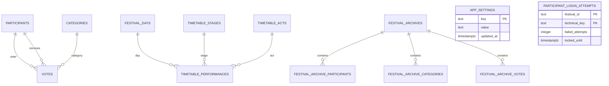

# Datenbankschema

Diese Dokumentation beschreibt den aktuellen Datenbankstand der Hurricane Awards App als technische Referenz fuer Entwickler. Fuer den groben Systemzusammenhang siehe [Architektur](architecture.md); fuer Sicherheitsdetails siehe [Sicherheitskonfiguration](security.md).

## Ueberblick

Die Datenbank speichert Teilnehmer, Abstimmungskategorien, Stimmen, zentrale App-Einstellungen, Festivalarchive und minimale technische Daten fuer Login-Rate-Limiting. Das Frontend greift aus dem Browser nicht direkt auf geschuetzte Tabellen zu, sondern nutzt Supabase RPC-Funktionen.

Das Schema besteht aus:

- aktiven Festivaldaten: `participants`, `categories`, `votes`
- historisch/kompatibel beruecksichtigten Daten: `archived_votes`
- zentralen Einstellungen: `app_settings`
- strukturierter Timetable-Basis: `festival_days`, `timetable_stages`, `timetable_acts`, `timetable_performances`
- Spiele: `bingo_*`, `horse_racing_*`, `random_pairing_*` und `tournaments`
- unveraenderlichen Festival-Snapshots: `festival_archives` und `festival_archive_*`
- technischem Login-Schutz: `participant_login_attempts`
- optionaler Ergebnisrelation: `all_time_standings`, falls in der Umgebung vorhanden

## Tabellen

### `participants`

Zweck: Speichert die Teilnehmer und ihre Login-/Admin-Eigenschaften.

Wichtigste Spalten:

- `id`: Teilnehmer-ID.
- `name`: Interner Name, aktuell beim Anlegen aus dem Anzeigenamen gesetzt.
- `display_name`: Anzeigename in der UI.
- `access_code`: Persoenlicher Teilnehmercode.
- `is_admin`: Kennzeichnet Adminteilnehmer.
- `is_active`: Steuert, ob ein Teilnehmer sich anmelden und Zugriff erhalten kann.

Primaerschluessel: `id`.

Fremdschluessel: In den vorhandenen Migrationen wird die Basistabelle nicht neu definiert. Andere Tabellen und RPCs referenzieren Teilnehmer logisch ueber `votes.voter_id`, `votes.voted_for_id` und Archivspalten.

Besonderheiten:

- Direkte Browserzugriffe sind per RLS/Grants gesperrt.
- `participants_access_code_upper_unique` erzwingt eindeutige Codes case-insensitive, wenn `access_code` gesetzt ist.
- Adminrechte werden serverseitig ueber `ha_has_admin_access` geprueft.
- Inaktive Teilnehmer werden beim Login wie ungueltige Codes behandelt.

### `categories`

Zweck: Speichert die Abstimmungskategorien.

Wichtigste Spalten:

- `id`: Kategorie-ID.
- `title`: Titel der Kategorie.
- `description`: Beschreibung.
- `status`: Status der Kategorie, verwendet werden `upcoming`, `open` und `closed`.
- `sort_order`: Sortierung fuer Anzeige und Adminverwaltung.

Primaerschluessel: `id`.

Fremdschluessel: Keine in den aktuellen Migrationen neu dokumentierte FK-Definition. `votes.category_id` und Archivdaten beziehen sich logisch auf Kategorien.

Besonderheiten:

- Direkte Browserzugriffe sind gesperrt.
- Stimmen koennen nur fuer Kategorien mit `status = 'open'` gespeichert werden.
- Kategorien mit vorhandenen Eintraegen in `votes` oder `archived_votes` werden durch `ha_delete_category` nicht geloescht.

### `votes`

Zweck: Speichert aktive Stimmen.

Wichtigste Spalten:

- `id`: Vote-ID, im Live-Schema vorhanden.
- `voter_id`: Teilnehmer, der abstimmt.
- `voted_for_id`: Teilnehmer, fuer den gestimmt wird.
- `category_id`: Kategorie der Stimme.
- `created_at`: Erstellzeitpunkt, im Live-Schema vorhanden.
- `timestamp`: fachlicher Zeitstempel der Stimme.

Primaerschluessel: `id`.

Fremdschluessel: Die aktuelle Migrationshistorie definiert die Basistabelle nicht neu. Die RPCs behandeln `voter_id` und `voted_for_id` als Teilnehmerreferenzen und `category_id` als Kategoriereferenz.

Besonderheiten:

- Direkte Browserzugriffe sind gesperrt.
- `votes_voter_category_unique` erzwingt eine Stimme pro Waehler und Kategorie.
- `ha_save_vote` verhindert Selbstvotes, Stimmen in nicht offenen Kategorien und Stimmen fuer nicht vorhandene Zielteilnehmer.

### `archived_votes`

Zweck: Aeltere Archiv-/Historientabelle fuer Stimmen, die weiterhin in Sicherheits- und Integritaetslogik beruecksichtigt wird.

Wichtigste Spalten:

- `id`: Archiv-Vote-ID.
- `festival`: Festivalbezug oder Festivalname.
- `voter_id`: Urspruenglicher Waehler.
- `voted_for_id`: Urspruenglich nominierter Teilnehmer.
- `category_id`: Urspruengliche Kategorie.
- `created_at`: Erstellzeitpunkt.
- `archived_at`: Archivierungszeitpunkt.

Primaerschluessel: `id`.

Fremdschluessel: Nicht in den aktuellen Migrationen neu definiert.

Besonderheiten:

- Direkte Browserzugriffe sind gesperrt.
- `ha_delete_category` prueft `archived_votes`, damit Kategorien mit historischen Stimmen nicht entfernt werden.
- Neuere vollstaendige Festival-Snapshots liegen in den `festival_archive_*` Tabellen.

### `app_settings`

Zweck: Speichert zentrale App-Einstellungen.

Wichtigste Spalten:

- `key`: Einstellungsname.
- `value`: Einstellungswert.
- `updated_at`: Zeitpunkt der letzten Aenderung.

Primaerschluessel: `key`.

Fremdschluessel: Keine.

Besonderheiten:

- Aktuell werden `festival_name` als zentraler Festivalname, `festival_access_code` als gemeinsamer Festivalcode, `camp_location_link` als optionaler Standortlink und `music_spotify_playlist_id` als optionale Spotify Playlist ID gespeichert.
- `app_settings_value_not_blank` verhindert leere Werte.
- Der Festivalname wird ueber `ha_get_festival_name` gelesen und ueber `ha_update_festival_name` mit Adminschutz geschrieben.
- Der Festivalcode wird fuer den Zugang ueber `ha_verify_festival_access_code` geprueft. Admins lesen ihn ueber `ha_get_festival_access_code` und schreiben ihn ueber `ha_update_festival_access_code`.
- Frische Deployments setzen keinen bekannten Default-Festivalcode; der initiale Code wird projektspezifisch per Setup-SQL geschrieben.
- Die Spotify Playlist wird nur als Playlist ID gespeichert. Embed- und Open-URL werden daraus abgeleitet; Spotify-Nutzerdaten, Access Tokens oder Refresh Tokens werden nicht gespeichert.
- Direkte Browserzugriffe sind gesperrt.

### `festival_days`

Zweck: Speichert eigenstaendige Festivaltage fuer den strukturierten Timetable.

Wichtigste Spalten:

- `id`: Festivaltag-ID.
- `date`: Kalendertag des Festivals.
- `label`: Anzeigename des Tages.
- `sort_order`: Sortierung fuer spaetere Anzeigen.

Primaerschluessel: `id`.

Besonderheiten:

- `date` ist eindeutig.
- Direkte Browserzugriffe sind gesperrt; Lesen laeuft ueber `ha_get_timetable`.

### `timetable_stages`

Zweck: Speichert Buehnen fuer den strukturierten Timetable.

Wichtigste Spalten:

- `id`: Buehnen-ID.
- `name`: Buehnenname.
- `sort_order`: Sortierung fuer spaetere Anzeigen.

Primaerschluessel: `id`.

Besonderheiten:

- Direkte Browserzugriffe sind gesperrt; Lesen laeuft ueber `ha_get_timetable`.

### `timetable_acts`

Zweck: Speichert Acts fuer den strukturierten Timetable.

Wichtigste Spalten:

- `id`: Act-ID.
- `name`: Act-Name.
- `description`: Optionale Beschreibung.

Primaerschluessel: `id`.

Besonderheiten:

- Direkte Browserzugriffe sind gesperrt; Lesen laeuft ueber `ha_get_timetable`.

### `timetable_performances`

Zweck: Verbindet genau einen Festivaltag, genau eine Buehne und genau einen Act zu einem Auftritt.

Wichtigste Spalten:

- `id`: Auftritt-ID.
- `festival_day_id`: Zugehoeriger Festivaltag.
- `stage_id`: Zugehoerige Buehne.
- `act_id`: Zugehoeriger Act.
- `starts_at`: Startzeitpunkt.
- `ends_at`: Endzeitpunkt.

Primaerschluessel: `id`.

Fremdschluessel:

- `festival_day_id` referenziert `festival_days(id)`.
- `stage_id` referenziert `timetable_stages(id)`.
- `act_id` referenziert `timetable_acts(id)`.

Besonderheiten:

- `ends_at` ist erforderlich und muss nach `starts_at` liegen.
- `timetable_performances_no_stage_overlap` verhindert zeitliche Ueberschneidungen auf derselben Buehne.
- Direkte Browserzugriffe sind gesperrt; Lesen laeuft ueber `ha_get_timetable`.

### `festival_access_attempts`

Zweck: Speichert technische Rate-Limit-Daten fuer Fehlversuche beim gemeinsamen Festivalcode.

Wichtigste Spalten:

- `festival_id`: Technischer Kontext, aktuell standardmaessig `current`.
- `technical_key`: Hash aus Request-Metadaten.
- `failed_attempts`: Anzahl aktueller Fehlversuche.
- `locked_until`: Zeitpunkt, bis zu dem weitere Pruefungen blockiert werden.
- `last_failed_at`: Zeitpunkt des letzten Fehlversuchs.
- `updated_at`: Zeitpunkt der letzten Aenderung.

Primaerschluessel: `(festival_id, technical_key)`.

Fremdschluessel: Keine.

Besonderheiten:

- Speichert keine Festivalcodes im Klartext.
- Direkte Browserzugriffe sind gesperrt.
- Erfolgreiche Festivalcode-Eingaben loeschen den passenden Zaehler.

### `festival_archives`

Zweck: Kopfdatensatz eines unveraenderlichen Festival-Snapshots.

Wichtigste Spalten:

- `id`: Archiv-ID.
- `festival_name`: Festivalname zum Archivierungszeitpunkt.
- `archived_at`: Archivierungszeitpunkt.
- `version_label`: Optionales Versionslabel.
- `created_by_participant_id`: Optionaler Adminteilnehmer, der archiviert hat.

Primaerschluessel: `id`.

Fremdschluessel: Keine aktive FK-Beziehung auf `participants`; `created_by_participant_id` ist bewusst nullable.

Besonderheiten:

- Wird durch `ha_archive_festival` angelegt.
- Direkte Browserzugriffe sind gesperrt.
- Archivdaten sind von aktiven Tabellen getrennt.

### `festival_archive_participants`

Zweck: Teilnehmerdaten innerhalb eines Festival-Snapshots.

Wichtigste Spalten:

- `id`: Archiv-Teilnehmerdatensatz.
- `archive_id`: Zugehoeriges Archiv.
- `original_participant_id`: Urspruengliche Teilnehmer-ID, falls als UUID interpretierbar.
- `display_name`: Anzeigename zum Archivierungszeitpunkt.
- `access_code`: Teilnehmercode zum Archivierungszeitpunkt.
- `is_admin`: Adminstatus zum Archivierungszeitpunkt.
- `is_active`: Aktivstatus zum Archivierungszeitpunkt.

Primaerschluessel: `id`.

Fremdschluessel:

- `archive_id` referenziert `festival_archives(id)`.

Besonderheiten:

- Keine FK-Beziehung auf aktive `participants`.
- Direkte Browserzugriffe sind gesperrt.

### `festival_archive_categories`

Zweck: Kategoriedaten innerhalb eines Festival-Snapshots.

Wichtigste Spalten:

- `id`: Archiv-Kategoriedatensatz.
- `archive_id`: Zugehoeriges Archiv.
- `original_category_id`: Urspruengliche Kategorie-ID, falls als UUID interpretierbar.
- `name`: Kategorie-Titel zum Archivierungszeitpunkt.
- `description`: Beschreibung zum Archivierungszeitpunkt.
- `sort_order`: Sortierung zum Archivierungszeitpunkt.
- `is_active`: Boolean-Ableitung aus `categories.status = 'open'` zum Archivierungszeitpunkt.

Primaerschluessel: `id`.

Fremdschluessel:

- `archive_id` referenziert `festival_archives(id)`.

Besonderheiten:

- Keine FK-Beziehung auf aktive `categories`.
- Direkte Browserzugriffe sind gesperrt.

### `festival_archive_votes`

Zweck: Stimmen innerhalb eines Festival-Snapshots inklusive Anzeigeinformationen.

Wichtigste Spalten:

- `id`: Archiv-Stimmendatensatz.
- `archive_id`: Zugehoeriges Archiv.
- `original_vote_id`: Urspruengliche Vote-ID, aktuell beim Archivieren `null`.
- `original_voter_id`: Urspruenglicher Waehler, falls als UUID interpretierbar.
- `original_category_id`: Urspruengliche Kategorie, falls als UUID interpretierbar.
- `original_nominee_id`: Urspruenglich nominierter Teilnehmer, falls als UUID interpretierbar.
- `voter_display_name`: Anzeigename des Waehlers zum Archivierungszeitpunkt.
- `category_name`: Kategoriename zum Archivierungszeitpunkt.
- `nominee_display_name`: Anzeigename des Nominierten zum Archivierungszeitpunkt.

Primaerschluessel: `id`.

Fremdschluessel:

- `archive_id` referenziert `festival_archives(id)`.

Besonderheiten:

- Speichert Anzeigeinformationen redundant, damit Archivdaten unabhaengig von aktiven Tabellen lesbar bleiben.
- Keine FK-Beziehungen auf aktive `votes`, `participants` oder `categories`.
- Direkte Browserzugriffe sind gesperrt.

### `participant_login_attempts`

Zweck: Minimale technische Daten fuer serverseitiges Rate-Limiting beim Teilnehmerlogin.

Wichtigste Spalten:

- `festival_id`: Festival-Kontext, aktuell default `current`.
- `technical_key`: Hash aus Festivalkontext und Request-Metadaten.
- `failed_attempts`: Anzahl fehlgeschlagener Versuche im aktuellen Fenster.
- `locked_until`: Zeitpunkt, bis zu dem weitere Loginversuche blockiert sind.
- `last_failed_at`: Zeitpunkt des letzten Fehlversuchs.
- `updated_at`: Zeitpunkt der letzten Aktualisierung.

Primaerschluessel: `(festival_id, technical_key)`.

Fremdschluessel: Keine.

Besonderheiten:

- Speichert keine Teilnehmercodes im Klartext.
- `participant_login_attempts_failed_attempts_valid` verhindert negative Zaehler.
- Alte, abgelaufene Daten werden in `ha_login_participant` bereinigt bzw. ignoriert.
- Direkte Browserzugriffe sind gesperrt.

### `tournaments`

Zweck: Speichert festivalbezogene Turniere als KO-Turnier mit optionalen Freilosen.

Wichtigste Spalten:

- `id`: Turnier-ID.
- `festival_id`: Technischer Festivalbezug.
- `name`: Anzeigename des Turniers.
- `mode`: Turniermodus. Bestehende Datenbanken werden mit dem Legacy-Default `ko` nachgeruestet; die UI verwendet aktuell `knockout`.
- `status`: Sichtbarkeits-/Arbeitsstatus, aktuell `draft` oder `active`.
- `selected_participant_ids`: Ausgewaehlte aktive Teilnehmende in Setzreihenfolge.
- `draw_participant_ids`: Einmalig zufaellig ausgeloste Reihenfolge der Teilnehmenden.
- `qualification_ranking_ids`: Legacy-Feld fuer nicht mehr genutzte Qualifikationsplatzierungen.
- `bracket`: Gespeicherter Single-Elimination-Baum als JSONB inklusive optionaler `byes` pro Runde.
- `created_by_participant_id`: Optionaler Adminteilnehmer, der das Turnier angelegt hat.

Primaerschluessel: `id`.

Besonderheiten:

- Direkte Browserzugriffe sind gesperrt.
- Admin-RPCs validieren mindestens zwei aktive Teilnehmende.
- Beim Anlegen wird `draw_participant_ids` serverseitig zufaellig erzeugt und gespeichert.
- Die Nachruestmigration `20260708150000_add_tournament_mode_column.sql` fuegt `mode` fuer bereits bestehende `tournaments`-Tabellen per `add column if not exists` hinzu.
- KO-Turniere erzeugen den KO-Baum sofort. Wenn die Teilnehmerzahl keine Zweierpotenz ist, werden Freilose ueber die gespeicherte Auslosung bestimmt und nicht als normale Begegnungen gespeichert.

## Beziehungen

Die aktiven Daten bilden fachlich diesen Kern:

- Ein Teilnehmer kann viele Stimmen abgeben: `participants.id` zu `votes.voter_id`.
- Ein Teilnehmer kann in vielen Stimmen nominiert werden: `participants.id` zu `votes.voted_for_id`.
- Eine Kategorie kann viele Stimmen enthalten: `categories.id` zu `votes.category_id`.
- Ein Festivalarchiv hat viele archivierte Teilnehmer, Kategorien und Stimmen ueber `archive_id`.
- Ein Auftritt verbindet einen Festivaltag, eine Buehne und einen Act.
- Ein Turnier referenziert Teilnehmende aktuell ueber `selected_participant_ids` logisch und speichert den erzeugten Baum in `bracket`.
- Archivtabellen speichern urspruengliche IDs als Werte, referenzieren aber bewusst keine aktiven Tabellen.
- `participant_login_attempts` ist technisch isoliert und hat keine fachlichen Beziehungen.

## Views

Die vorhandenen Migrationen erstellen keine View und keine Materialized View.

Die App kennt jedoch die Relation `all_time_standings`. Die Sicherheitsmigration behandelt sie bewusst flexibel:

- Wenn `all_time_standings` eine Tabelle ist, wird RLS aktiviert.
- Wenn sie eine View oder Materialized View ist, werden direkte Rechte entzogen und der Zugriff laeuft ueber `ha_list_all_time_standings`.
- Wenn sie nicht existiert, wirft `ha_list_all_time_standings` zur Laufzeit einen Fehler.

Erwartete Spalten fuer die App:

- `participant_id`
- `participant_name`
- `total_points`

## RPC-Funktionen

Dies ist keine vollstaendige API-Referenz, sondern eine Gruppierung der wichtigsten RPCs.

### Login

- `ha_login_participant`: Prueft Teilnehmercodes, beruecksichtigt `is_active`, zaehlt Fehlversuche und gibt `success`, `invalid` oder `blocked` zurueck.
- `ha_login_rate_limit_key`: Erzeugt den technischen Hash fuer Rate-Limiting.

### Teilnehmer

- `ha_list_participants`: Listet Teilnehmer ohne Access Codes fuer angemeldete Teilnehmer.
- `ha_admin_list_participants`: Adminliste inklusive Codes und Status.
- `ha_suggest_participant_access_code`: Generiert einen neuen Codevorschlag.
- `ha_create_participant`, `ha_update_participant`: Admin-RPCs fuer Teilnehmerpflege.
- `ha_deactivate_participant`, `ha_reactivate_participant`: Admin-RPCs fuer Aktivstatus.

### Kategorien

- `ha_list_categories`: Kategorien fuer angemeldete Teilnehmer.
- `ha_admin_list_categories`: Kategorien fuer Admins inklusive Sortierung.
- `ha_create_category`, `ha_update_category`, `ha_update_category_status`, `ha_delete_category`: Admin-RPCs fuer Kategorien.

### Votes

- `ha_list_participant_votes`: Eigene Stimmen eines Teilnehmers.
- `ha_list_result_votes`: Stimmen fuer Ergebnisanzeigen.
- `ha_save_vote`: Speichert eine Stimme mit serverseitiger Validierung.
- `ha_delete_category_votes`: Entfernt Stimmen einer Kategorie als Adminfunktion.

### Festival

- `ha_get_festival_name`: Liest den zentralen Festivalnamen.
- `ha_update_festival_name`: Aktualisiert den Festivalnamen mit Adminschutz.
- `ha_get_festival_access_version`: Liefert eine technische Version des Festivalcodes fuer lokal gespeicherte Freischaltungen.
- `ha_verify_festival_access_code`: Prueft den gemeinsamen Festivalcode mit serverseitigem Rate Limiting, ohne den gespeicherten Codewert zurueckzugeben.
- `ha_get_festival_access_code`: Liest den gemeinsamen Festivalcode mit Adminschutz.
- `ha_update_festival_access_code`: Aktualisiert den gemeinsamen Festivalcode mit Adminschutz.
- `ha_list_all_time_standings`: Liefert das Gesamtclassement, falls `all_time_standings` vorhanden ist.

### Timetable

- `ha_get_timetable`: Liefert Festivaltage, Buehnen, Acts und Auftritte fuer angemeldete Teilnehmer als technische Basisdaten.
- `ha_admin_list_festival_days`: Listet Festivaltage fuer Admins.
- `ha_create_festival_day`, `ha_update_festival_day`, `ha_delete_festival_day`: Admin-RPCs fuer Festivaltage inklusive eindeutiger Datumsvalidierung.
- `ha_admin_list_timetable_stages`: Listet Buehnen fuer Admins.
- `ha_create_timetable_stage`, `ha_update_timetable_stage`, `ha_delete_timetable_stage`: Admin-RPCs fuer Buehnen inklusive eindeutiger Namensvalidierung.
- `ha_admin_list_timetable_acts`: Listet Acts fuer Admins.
- `ha_create_timetable_act`, `ha_update_timetable_act`, `ha_delete_timetable_act`: Admin-RPCs fuer Acts. Acts bleiben unabhaengig von Auftritten; `ha_delete_timetable_act` verhindert das Loeschen bereits zugeordneter Acts.
- `ha_admin_list_timetable_performances`: Listet Auftritte fuer Admins.
- `ha_create_timetable_performance`, `ha_update_timetable_performance`, `ha_delete_timetable_performance`: Admin-RPCs fuer Auftritte. Ein Datenbank-Constraint verhindert zeitliche Ueberschneidungen auf derselben Buehne; `ends_at` ist erforderlich und muss nach `starts_at` liegen.

### Turniere

- `ha_list_tournaments`: Listet aktive Turniere inklusive gespeichertem Turnierbaum fuer angemeldete Teilnehmende.
- `ha_admin_list_tournaments`: Listet alle Turniere fuer Admins.
- `ha_admin_create_tournament`: Legt ein Turnier an, validiert aktive Teilnehmende und speichert eine zufaellige Auslosung.
- `ha_admin_update_tournament`: Bearbeitet Name, Modus und Teilnehmendenauswahl und erzeugt eine neue gespeicherte Auslosung.
- `ha_admin_set_tournament_qualification_ranking`: Legacy-RPC fuer den nicht mehr in der UI genutzten Qualifikationsmodus.
- `ha_admin_delete_tournament`: Loescht ein Turnier.
- `ha_generate_tournament_bracket`: Interne Hilfsfunktion zur Baumgenerierung inklusive Freilosen fuer nicht passende Teilnehmerzahlen.
- `ha_seed_tournament_participants`: Interne Hilfsfunktion fuer Setzung nach Platzierung, z. B. 1 gegen 8, 4 gegen 5, 2 gegen 7, 3 gegen 6.

### Archivierung

- `ha_archive_festival`: Erstellt einen Snapshot aus Teilnehmern, Kategorien und Stimmen in den Festivalarchivtabellen.

## Sicherheitskonzept

- Row Level Security ist fuer geschuetzte Tabellen aktiviert.
- Direkte Tabellenrechte fuer `anon` und `authenticated` sind fuer geschuetzte Tabellen entzogen.
- Browserzugriffe laufen ueber gezielte `SECURITY DEFINER` RPC-Funktionen.
- Adminrechte werden serverseitig ueber `ha_has_admin_access` und aktive Adminteilnehmer geprueft.
- Teilnehmerzugriffe pruefen den Teilnehmercode serverseitig ueber Hilfsfunktionen wie `ha_participant_id_for_access`.
- Login-Rate-Limiting laeuft serverseitig ueber `participant_login_attempts`; Festivalcode-Rate-Limiting laeuft ueber `festival_access_attempts`. Klartextcodes werden in diesen Tabellen nicht gespeichert.
- Der aeltere direkte Login-Lookup `ha_find_participant` ist fuer Browserrollen entzogen.

## Wartung

- Schemaaenderungen immer als neue Migration unter `supabase/migrations` erfassen.
- Neue Tabellen, Spalten, Indizes, Policies, Grants und RPCs in diesem Dokument nachziehen.
- Sicherheitsrelevante Aenderungen auch in [docs/security.md](security.md) pruefen.
- Architekturveraenderungen mit [docs/architecture.md](architecture.md) abgleichen.
- Bei neuen sichtbaren UI-Auswirkungen die Tests und Uebersetzungsdateien pruefen.
- Migrationstests in `src/test/securityMigration.test.ts` aktualisieren, wenn sich Struktur oder Sicherheitsannahmen aendern.
